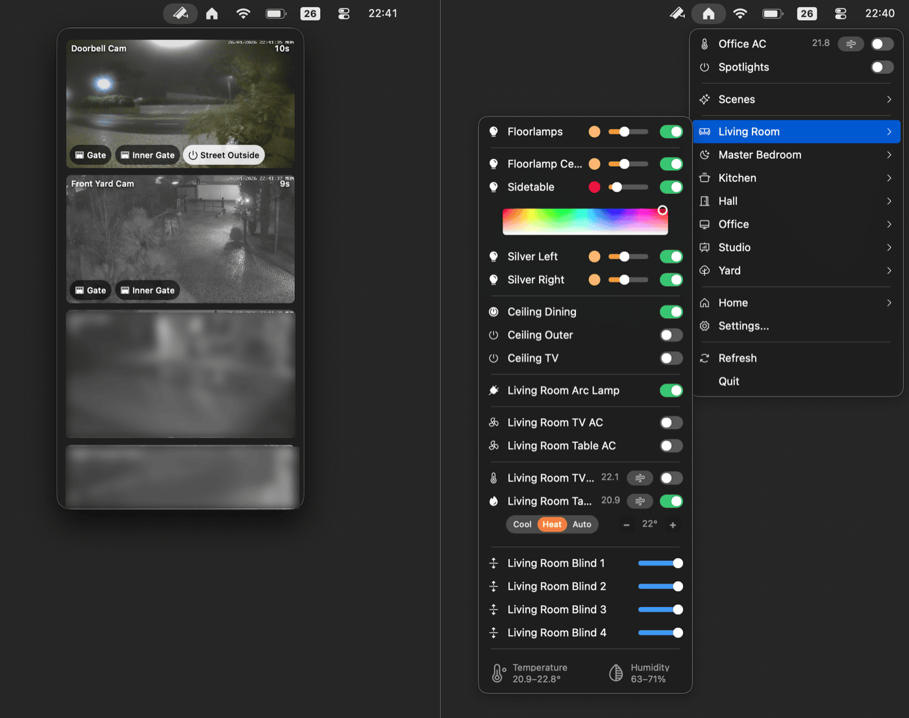

# Itsyhome  

[](https://github.com/nickustinov/itsyhome-macos/actions/workflows/test.yml)

[](https://apps.apple.com/app/itsyhome/id6758070650)



A native macOS menu bar app for controlling your HomeKit and Home Assistant smart home.

**[itsyhome.app](https://itsyhome.app)**

## Features

- **Menu bar access** - Control your smart home from the macOS menu bar
- **HomeKit support** - Full integration with Apple HomeKit devices and scenes
- **Home Assistant support** - Connect to your Home Assistant server via WebSocket API
- **Scenes** - Execute and toggle scenes with automatic state tracking
- **Favourites** - Pin frequently used devices, scenes, and groups to the top of the menu
- **Multi-home support** - Switch between multiple HomeKit homes (HomeKit only)
- **Native experience** - Built with AppKit for a true macOS look and feel
- **Menu bar pinning** - Pin rooms, devices, scenes, or groups as separate menu bar items with optional keyboard shortcuts
- **Device groups** - Create custom groups to control multiple devices at once *(Pro)*
- **iCloud sync** - Sync favourites, groups, and settings across your Macs *(Pro)*
- **Deeplinks** - Control devices from Shortcuts, Alfred, Raycast, Stream Deck *(Pro)*
- **Cameras** - Live video feed with overlay action buttons to control nearby accessories *(Pro)*
- **Doorbell notifications** - Automatic camera view with live stream when a doorbell rings *(Pro)*
- **Webhooks/CLI** - Built-in HTTP server with a dedicated CLI tool *(Pro)*
- **Event stream (SSE)** - Real-time device state changes via Server-Sent Events for external automation *(Pro)*
- **[Itsytv](https://itsytv.app)** - Free companion app for controlling Apple TV from your menu bar

## Supported devices

### HomeKit

| Device type | Features |
|-------------|----------|
| Lights | On/off, brightness slider, RGB color picker, color temperature picker |
| Switches & Outlets | On/off toggle, in-use indicator for outlets |
| Fans | On/off, speed slider, auto mode, rotation direction, swing mode |
| Thermostats | Off/Heat/Cool/Auto modes, target temperature stepper, heating/cooling thresholds for Auto mode |
| AC / Heater-Cooler | Auto/Heat/Cool modes, temperature control, swing mode toggle |
| Blinds / Window coverings | Position slider, horizontal/vertical tilt control |
| Locks | Lock/unlock toggle with status |
| Garage doors | Open/close toggle, status display (opening/closing/stopped), obstruction detection |
| Humidifiers & Dehumidifiers | Auto/Humidify/Dehumidify modes, humidity display, water level indicator, swing mode |
| Air purifiers | Manual/Auto modes, speed slider, swing mode |
| Valves | Open/close toggle, in-use indicator (irrigation, shower, faucet types) |
| Security systems | Off/Stay/Away/Night modes, triggered state indicator |
| Cameras | Live video feed with overlay action buttons to control nearby accessories *(Pro)* |
| Doorbells | Automatic camera view on ring with live stream and configurable chime sound *(Pro)* |
| Temperature & Humidity sensors | Summary display per room with ranges |

### Home Assistant

Connects via WebSocket API for real-time updates. On first launch, choose your platform. Switch anytime in Settings → General.

**Setup:** Profile → Security → Long-Lived Access Tokens → Create token → Enter server URL and token in Itsyhome settings.

| Entity | Features |
|--------|----------|
| `light` | On/off, brightness slider, RGB color picker, color temperature picker |
| `switch`, `input_boolean` | On/off toggle |
| `fan` | On/off, speed slider, direction, oscillation |
| `climate` | Off/Heat/Cool/Auto/Fan modes, target temperature, presets |
| `cover` (blinds) | Position slider, tilt control |
| `cover` (garage/gate) | Open/close toggle, status display (opening/closing/stopped) |
| `lock` | Lock/unlock toggle with status |
| `humidifier` | On/off, modes, target humidity |
| `valve` | Open/close toggle |
| `alarm_control_panel` | Off/Stay/Away/Night modes, triggered state indicator |
| `camera` | Live snapshots and WebRTC streaming *(Pro)* |
| `scene` | Activation with state tracking via scene config |

**Notes:**
- Entities are automatically grouped by device and area
- Cameras require the `stream` integration for live video
- Scene state tracking requires scenes created in the Home Assistant UI (not YAML)

## Itsyhome Pro

### Device groups

Create custom groups of devices to control multiple devices at once. Groups can be scoped to a room or made global. Light groups support full control (power, brightness, color), blind groups control position, and lock groups toggle all locks together. Groups show partial state indicators when devices differ (e.g., "2/3 on").

### Cameras

View live video feeds from your cameras directly in the menu bar. Supports HomeKit cameras and Home Assistant cameras with WebRTC streaming. Overlay action buttons let you control nearby accessories without leaving the camera view — toggle lights and outlets, open garage doors and gates, or lock and unlock doors.

### Doorbell notifications

When a doorbell rings, the camera panel automatically opens in the top-right corner of the screen with a pinned live stream of the doorbell camera. Supports HomeKit doorbells and Home Assistant doorbell events. A configurable chime sound plays on ring. Both the automatic camera display and the sound can be independently toggled in Settings → Cameras.

### iCloud sync

Sync your favourites, hidden items, device groups, shortcuts, and pinned items across all your Macs.

### Deeplinks

Control your smart home devices from external apps using URL schemes. Perfect for Shortcuts, Alfred, Raycast, Stream Deck, and other automation tools. Works with both HomeKit and Home Assistant.

**URL format:**
```
itsyhome://<action>/<target>
```

**Actions:**

| Action | URL format | Example |
|--------|-----------|---------|
| Toggle | `itsyhome://toggle/<Room>/<Device>` | `itsyhome://toggle/Office/Spotlights` |
| Turn on | `itsyhome://on/<Room>/<Device>` | `itsyhome://on/Kitchen/Light` |
| Turn off | `itsyhome://off/<Room>/<Device>` | `itsyhome://off/Bedroom/Lamp` |
| Brightness | `itsyhome://brightness/<0-100>/<Room>/<Device>` | `itsyhome://brightness/50/Office/Lamp` |
| Position | `itsyhome://position/<0-100>/<Room>/<Device>` | `itsyhome://position/75/Living%20Room/Blinds` |
| Temperature | `itsyhome://temp/<degrees>/<Room>/<Device>` | `itsyhome://temp/22/Hallway/Thermostat` |
| Color | `itsyhome://color/<hue>/<saturation>/<Room>/<Device>` | `itsyhome://color/120/100/Bedroom/Light` |
| Scene | `itsyhome://scene/<Scene%20Name>` | `itsyhome://scene/Goodnight` |
| Lock | `itsyhome://lock/<Room>/<Device>` | `itsyhome://lock/Front%20Door` |
| Unlock | `itsyhome://unlock/<Room>/<Device>` | `itsyhome://unlock/Front%20Door` |
| Open | `itsyhome://open/<Room>/<Device>` | `itsyhome://open/Garage/Door` |
| Close | `itsyhome://close/<Room>/<Device>` | `itsyhome://close/Bedroom/Blinds` |

**Target formats:**

- `Room/Device` - Device in specific room (e.g., `Office/Spotlights`)
- `Room/group.Name` - Group scoped to a room (e.g., `Office/group.All%20Lights`)
- `group.Name` - Global group (e.g., `group.Office%20Lights`)

**Testing from terminal:**
```bash
open "itsyhome://toggle/Office/Spotlights"
open "itsyhome://toggle/Office/group.All%20Lights"
open "itsyhome://toggle/group.Office%20Lights"
open "itsyhome://scene/Goodnight"
open "itsyhome://brightness/50/Bedroom/Lamp"
```

**Note:** Spaces in room or device names must be URL-encoded as `%20`.

### Webhooks/CLI

A built-in HTTP server that lets you control and query your smart home devices from any tool on your network — terminal, scripts, other apps, or the dedicated [itsyhome CLI](https://github.com/nickustinov/itsyhome-cli). Works with both HomeKit and Home Assistant.

Enable the server in Settings → Webhooks/CLI. Default port: `8423`.

**Control endpoints:**

```bash
curl http://localhost:8423/toggle/Office/Spotlights
curl http://localhost:8423/on/Kitchen/Light
curl http://localhost:8423/off/Bedroom/Lamp
curl http://localhost:8423/brightness/50/Office/Lamp
curl http://localhost:8423/position/75/Living%20Room/Blinds
curl http://localhost:8423/temp/22/Hallway/Thermostat
curl http://localhost:8423/color/120/100/Bedroom/Light
curl http://localhost:8423/scene/Goodnight
curl http://localhost:8423/lock/Front%20Door
curl http://localhost:8423/unlock/Front%20Door
curl http://localhost:8423/open/Garage/Door
curl http://localhost:8423/close/Bedroom/Blinds
```

**Query endpoints:**

| Endpoint | Description |
|----------|-------------|
| `/status` | Home summary (rooms, devices, reachable/unreachable counts) |
| `/list/rooms` | List all rooms |
| `/list/devices` | List all devices with type and reachability |
| `/list/devices/<room>` | List devices in a specific room |
| `/list/scenes` | List all scenes |
| `/list/groups` | List all device groups (includes room info for room-scoped groups) |
| `/list/groups/<room>` | List groups available in a specific room (room-scoped + global) |
| `/info/<target>` | Detailed device/room info with current state |
| `/events` | SSE event stream for real-time characteristic changes |

**Event stream (SSE):**

Stream real-time device state changes using [Server-Sent Events](https://developer.mozilla.org/en-US/docs/Web/API/Server-sent_events). Connect with `curl -N` or any SSE client (including `EventSource` in browsers). Only actual value changes are emitted — read refreshes are filtered out.

```bash
curl -N http://localhost:8423/events
```

Each event is a JSON object on a `data:` line:

```
data: {"characteristic":"brightness","characteristicId":"ABC-123","device":"Desk Lamp","entityId":"light.desk_lamp","room":"Office","serviceId":"DEF-456","timestamp":"2026-02-09T14:30:00Z","type":"light","value":75}
```

| Field | Description |
|-------|-------------|
| `device` | Human-readable device name |
| `room` | Room the device belongs to |
| `type` | Device type (`light`, `switch`, `thermostat`, `blinds`, etc.) |
| `characteristic` | Characteristic that changed (`power`, `brightness`, `current-temperature`, etc.) |
| `value` | New value (type varies: boolean, integer, double) |
| `characteristicId` | UUID of the characteristic |
| `serviceId` | UUID of the service |
| `entityId` | Home Assistant entity ID (only present for HA devices) |
| `timestamp` | ISO 8601 timestamp |

Multiple clients can connect simultaneously. A `: heartbeat` comment is sent every 15 seconds to keep connections alive.

**Response format:**

```json
{"status": "success"}
{"status": "error", "message": "device not found"}
```

**CLI tool:**

Install the dedicated CLI for a better terminal experience:

```bash
brew install nickustinov/tap/itsyhome
```

See [itsyhome-cli](https://github.com/nickustinov/itsyhome-cli) for full documentation.

### Stream Deck

Control your smart home devices directly from an Elgato Stream Deck using the [Itsyhome Stream Deck plugin](https://marketplace.elgato.com/product/itsyhome-c1aadf59-d8ef-4ac0-8af2-0e2e0bf950a2). Works with both HomeKit and Home Assistant. Requires the webhook server to be enabled.

[](https://marketplace.elgato.com/product/itsyhome-c1aadf59-d8ef-4ac0-8af2-0e2e0bf950a2)

**Actions:**

| Action | Description |
|--------|-------------|
| Switch/Outlet | Toggle a switch or outlet on/off |
| Execute scene | Trigger a HomeKit scene |
| Light | Toggle a light on/off with optional target brightness |
| Fan | Toggle a fan on/off with speed display |
| Humidifier | Toggle a humidifier/dehumidifier on/off with humidity display |
| Lock | Lock/unlock with optimistic feedback |
| AC | Toggle thermostat/AC with mode-aware icons (heat/cool/auto) |
| Status | Display temperature or humidity readings |
| Blinds | Open/close blinds with position display |
| Garage door | Open/close garage door with state feedback |
| Security system | Arm/disarm a security system with mode selection |
| Group | Turn on/off a device group with partial count display |

Features include color-coded icons per device type, dynamic state display, live state polling, optimistic updates for slow devices (locks, garage doors), custom on/off colors, and optional labels for multi-button setups.

Source code: [itsyhome-streamdeck](https://github.com/nickustinov/itsyhome-streamdeck)

## Itsytv — the perfect companion

<table>
<tr>
<td width="340">

</td>
<td>

**[Itsytv](https://itsytv.app)** is a free, open-source macOS menu bar app for controlling Apple TV — the missing remote app for your Mac.

- Full D-pad and playback remote
- Now playing widget with live progress
- Browse and launch Apple TV apps
- Keyboard shortcuts for quick control
- Text input for searches and passwords
- Multi-device support
- End-to-end encrypted, no tracking

Built with Swift and SwiftUI. Free forever, MIT licensed.

**[itsytv.app](https://itsytv.app)** · [GitHub](https://github.com/nickustinov/itsytv-macos)

</td>
</tr>
</table>

## Requirements

- macOS 14.0 or later
- Xcode 15.0 or later
- [XcodeGen](https://github.com/yonaskolb/XcodeGen) for project generation
- Apple Developer account with HomeKit entitlement (for HomeKit mode)
- Home Assistant server with long-lived access token (for Home Assistant mode)

## Setup

### 1. Install XcodeGen

```bash
brew install xcodegen
```

### 2. Clone the repository

```bash
git clone https://github.com/nickustinov/itsyhome-macos.git
cd itsyhome-macos
```

### 3. Configure your bundle ID and team

Edit `project.yml` and update:

```yaml
options:
  bundleIdPrefix: com.yourdomain  # Your reverse domain

settings:
  base:
    DEVELOPMENT_TEAM: YOUR_TEAM_ID  # Uncomment and set your team ID
```

### 4. Generate the Xcode project

```bash
xcodegen generate
```

### 5. Open and run

```bash
open Itsyhome.xcodeproj
```

Select the **Itsyhome** scheme and run on **My Mac (Mac Catalyst)**.

## Architecture

This app uses Mac Catalyst with a native AppKit plugin for the menu bar:

```
Itsyhome/
├── iOS/                           # Main Catalyst app (hidden, headless)
│   ├── AppDelegate.swift          # App lifecycle, loads macOS plugin
│   ├── HomeKitManager.swift       # HomeKit integration (Mac2iOS protocol)
│   ├── SceneDelegate.swift
│   └── CameraSceneDelegate.swift  # Camera window handling
├── Shared/                        # Shared code between iOS and macOS
│   ├── SmartHomePlatform.swift    # Platform abstraction protocol
│   ├── PlatformManager.swift      # Platform selection state
│   ├── BridgeProtocols.swift      # Bridge protocols & codable data structures
│   └── URLSchemeHandler.swift     # URL scheme deeplink handling
├── HomeAssistant/                 # Home Assistant integration
│   ├── HomeAssistantPlatform.swift # SmartHomePlatform implementation
│   ├── HomeAssistantClient.swift  # WebSocket + REST API client
│   ├── HAAuthManager.swift        # Credentials storage (Keychain)
│   ├── HAModels.swift             # Entity/area/device models
│   └── EntityMapper.swift         # HA entities → menu data conversion
└── Resources/

macOSBridge/                       # Native AppKit plugin for menu bar
├── MacOSController.swift          # Main menu bar controller (iOS2Mac protocol)
├── MenuBuilder.swift              # Builds NSMenu from service data
├── ActionEngine/                  # Unified API for executing actions
│   ├── ActionEngine.swift         # Core action execution engine
│   ├── ActionParser.swift         # Parses actions from URL schemes
│   └── DeviceResolver.swift       # Resolves targets to devices
├── HomeAssistant/                 # HA-specific UI components
│   └── HomeAssistantBridge.swift  # Mac2iOS adapter for HA platform
├── PlatformPicker/                # First-launch platform selection UI
├── MenuItems/                     # Device-specific menu item views
├── DesignSystem/                  # shadcn/ui-inspired design tokens
├── Controls/                      # Custom UI controls
├── Settings/                      # Preferences & settings UI
├── Pro/                           # Pro subscription management (StoreKit 2)
├── Sync/                          # iCloud sync (Pro)
├── Webhook/                       # HTTP server (Pro)
├── Models/                        # Data models
└── Utilities/                     # Helpers (color conversion, icon mapping)
```

The app supports two smart home platforms via a shared `SmartHomePlatform` protocol:

- **HomeKit**: The iOS/Catalyst app runs headless and manages HomeKit communication via the native HomeKit framework
- **Home Assistant**: Connects directly via WebSocket API with real-time state subscriptions

Both platforms output the same `MenuData` format, allowing the menu bar UI to work identically regardless of platform.

## How it works

**HomeKit mode:**
1. The Catalyst app initializes HomeKit and monitors for device updates
2. Device data is serialized to JSON and passed to the macOS plugin
3. The plugin renders custom `NSMenuItem` views with controls
4. User interactions are sent back to the Catalyst app to execute HomeKit commands

**Home Assistant mode:**
1. The macOS plugin connects directly to Home Assistant via WebSocket
2. Entity states are fetched and mapped to the common `MenuData` format
3. Real-time state changes are received via WebSocket subscriptions
4. User interactions call Home Assistant services directly via the REST API

## Building

The project uses XcodeGen to generate the Xcode project from `project.yml`. After making changes to project configuration:

```bash
xcodegen generate
```

## Testing

The project includes comprehensive unit tests for the macOSBridge plugin. Run tests with:

```bash
xcodebuild test -scheme Itsyhome -destination "platform=macOS"
```

Test coverage includes:

| Test suite | Description |
|------------|-------------|
| `*MenuItemTests` | Menu item behaviour for all device types (Light, Switch, Fan, Thermostat, AC, Blind, Lock, GarageDoor, Humidifier, AirPurifier, Valve, SecuritySystem) |
| `ValueConversionTests` | Type conversion utilities for HomeKit values |
| `LocalChangeNotifiableTests` | Notification protocol for syncing menu items |
| `ActionEngineTests` | Action parsing and execution (toggle, brightness, scenes, etc.) |
| `ActionParserTests` | URL scheme parsing |
| `DeviceResolverTests` | Target resolution logic |
| `URLSchemeHandlerTests` | URL scheme handler |
| `WebhookServerTests` | HTTP server lifecycle and endpoints |
| `WebhookSSETests` | SSE event streaming, client management, characteristic index |
| `CloudSyncManagerTests` | iCloud sync |
| `CloudSyncTranslatorTests` | ID translation for sync (cameras, groups, order, shortcuts) |
| `DeviceGroupTests` | Device group functionality |
| `PreferencesManagerTests` | Settings persistence |
| `IconResolverTests` | Device icon resolution |
| `ProStatusCacheTests` | Pro status caching |

## Debugging

Startup diagnostics logging can be enabled by setting `StartupLogger.enabled = true` in `macOSBridge/Utilities/StartupLogger.swift`. Logs are emitted via `os_log` with subsystem `com.nickustinov.itsyhome` and category `Startup`, viewable in Console.app or via:

```bash
log stream --predicate 'subsystem == "com.nickustinov.itsyhome"' --level info
```

**Home Assistant debugging:**

For local testing without real hardware, run the Home Assistant demo:

```bash
docker run -d --name homeassistant -p 8123:8123 ghcr.io/home-assistant/home-assistant:stable
```

Then navigate to `http://localhost:8123`, create an account, and generate a long-lived access token.

### Webhook debug endpoints

When the webhook server is running, three debug endpoints are available to inspect raw HomeKit data:

| Endpoint | Description |
|---|---|
| `GET /debug/<name>` | Returns characteristics, service type, limits, room, and reachability for a specific device or service matched by name |
| `GET /debug/all` | Dumps all accessories with their services, rooms count, and scenes count |
| `GET /debug/raw` | Returns the complete raw HomeKit data dump from the iOS bridge including service groups, zones, action sets, and triggers |

Example using curl:

```bash
curl http://localhost:<port>/debug/all
curl http://localhost:<port>/debug/Living%20Room%20Light
curl http://localhost:<port>/debug/raw
```

## HomeKit entitlement

This app requires the HomeKit entitlement. You'll need to:

1. Enable HomeKit capability in your Apple Developer account
2. Create an App ID with HomeKit enabled
3. The entitlement is already configured in `Itsyhome/Itsyhome.entitlements`

## License

MIT License © 2026 Nick Ustinov - see [LICENSE](LICENSE) for details.

## Author

**Nick Ustinov**
- Email: nick@ustinov.cc
- Website: [itsyhome.app](https://itsyhome.app)
- GitHub: [@nickustinov](https://github.com/nickustinov)

## Links

- **Website**: [itsyhome.app](https://itsyhome.app)
- **Issues**: [GitHub Issues](https://github.com/nickustinov/itsyhome-macos/issues)

## Contributing

Contributions are welcome! Please feel free to submit issues and pull requests.
